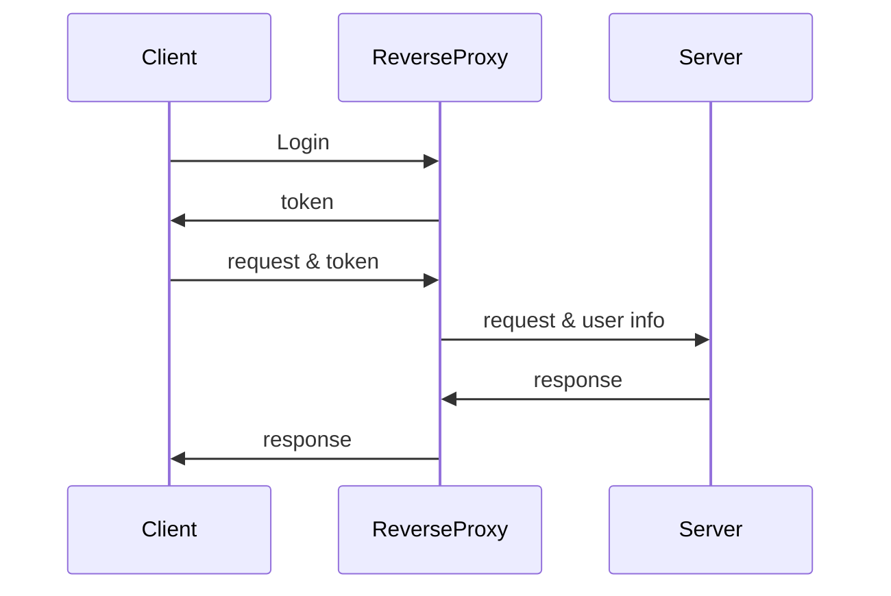

```mermaid
sequenceDiagram
    participant Client
    participant ReverseProxy
    participant Server
    Client->>ReverseProxy: Login
    ReverseProxy->>Client: token
    Client->>ReverseProxy: request & token
    ReverseProxy->>Server: request & user info
    Server->>ReverseProxy: response
    ReverseProxy->>Client: response
```
