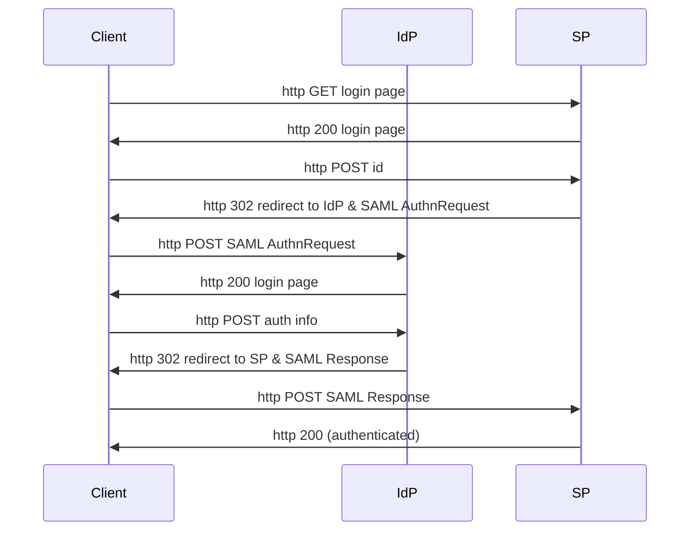

SP: Service Provider
IdP: Identity Provider

```mermaid
sequenceDiagram
    participant Client
    participant IdP
    participant SP
    Client->>SP: http GET login page
    SP->>Client: http 200 login page
    Client->>SP: http POST id
    SP->>Client: http 302 redirect to IdP & SAML AuthnRequest
    Client->>IdP: http POST SAML AuthnRequest
    IdP->>Client: http 200 login page
    Client->>IdP: http POST auth info
    IdP->>Client: http 302 redirect to SP & SAML Response
    Client->>SP: http POST SAML Response
    SP->>Client: http 200 (authenticated)
```
